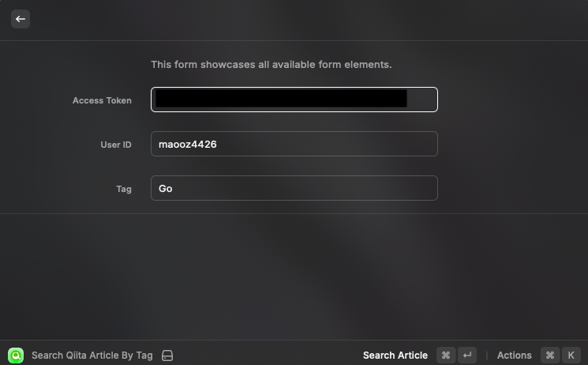
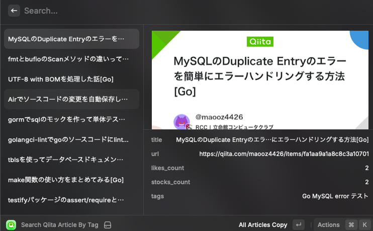

# Search Qiita Article

特定ユーザーの記事をタグで検索することできるRaycast拡張機能です。

# 使用方法
## 検索画面

検索画面の入力フィールドは以下のようになっています。

|formのフィールド|入力内容|example
|---|---|---
|AccessToken|Qiitaで発行できるアクセストークン|xxxxxxxxx
|UserID|@を抜いたUserID|maooz4426
|Tag|検索したいタグ｜Go ライブラリ

## 結果画面

結果画面では、検索した結果を表示します。

各記事表示しているデータは以下の通りです。

|プロパティ|説明
|---|---
|title|記事のタイトル
|url|記事のurl
|likes_count|いいね数
|stocks_count|ストック数
|tags|設定されてるタグ

また設定されているアクションは以下の通りです。

| アクション             |内容
|-------------------|---
| All Articles Copy |検索結果の全記事のURLをコピー
| Copy Article URL  |選択されている記事のURLをコピー
| Open In Blowser|ブラウザで選択した記事を開く

